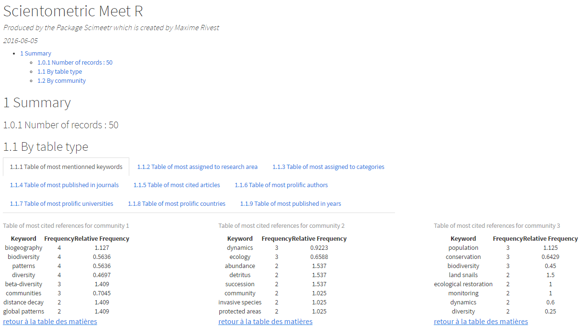

# scimeetr

Scientometric Meet R is a package in developpment. With scimeetr you can detect your scientific community and generate a relevant reading list. This is especially usefull when doing interdisciplinary work or joining a new field.

## Install
`scimeetr` can now be installed directly from the R console using the following lines :

>if (!require("devtools")) install.packages("devtools")

>devtools::install_github("MaximeRivest/scimeetr")

Note: Windows users will need to install the software [Rtools](https://cran.r-project.org/bin/windows/Rtools/) and the package devtools to install this way.

## Example of scimeetr's output

