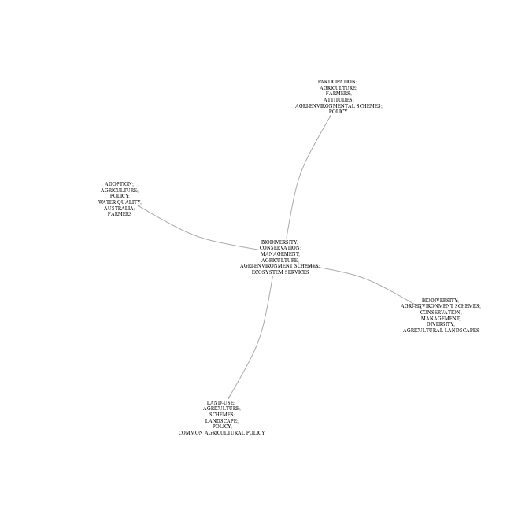

Scimeetr
================

-   [Install](#install)
-   [Introduction](#introduction)
-   [From data to reading list](#from-data-to-reading-list)
    -   [loading and exploring bibliometric data](#loading-and-exploring-bibliometric-data)
    -   [Mapping scientific community](#mapping-scientific-community)
    -   [Automatically generating a reading list of seminal papers](#automatically-generating-a-reading-list-of-seminal-papers)
-   [In depth description of each steps](#in-depth-description-of-each-steps)
    -   [How to get bibliometric data?](#how-to-get-bibliometric-data)

Install
=======

`scimeetr` can be installed directly from the R console using the following lines :

> if (!require("devtools")) install.packages("devtools")

> devtools::install\_github("MaximeRivest/scimeetr")

Introduction
============

Scimeetr helps explore the scholarly literature. It contains a suit of function that let someone:

-   load bibliometric data into R
-   make a map of peer reviewed papers by creating various networks
-   find research community
-   characterise the research communities
-   generate reading list

This tutorial is composed of two self-contained section. The first section show case the whole process with all the default parameters. The second section describes each function in more detail by presenting the rational for the function, the algorithms used and the options.

From data to reading list
=========================

You can automatically generate a reading list of seminal papers in a research litterature by using only those three functions: `ìmport_wos_files`, `scimap`, and `scilist`. This first section describes this process in more details.

loading and exploring bibliometric data
---------------------------------------

The first step in exploring the literature is to retrieve bibliometric data from the *Web of Science* or *Scopus*. In this first tutorial I use a dataset from the *Web of Science* about ecological networks.

``` r
library(scimeetr)
scimeetr_list <- import_wos_files("path/to/folder/")
```

Then,`summary` can be used to get a quick characterisation of the data.

``` r
summary(scimeetr_list)
```

    ## 
    ##  # Summary of Scimeetr #
    ## -----------------------
    ##     Number of papers:  409
    ##     Number of different reference:  17277
    ## 
    ##     Average number of reference per paper:  52
    ## 
    ##     Quantiles of total citation per paper: 
    ## 
    ##   0%  25%  50%  75% 100% 
    ##    0    1    6   15  622 
    ## 
    ##     Mean number of citation per paper:  16.32763
    ## 
    ##     Average number of citation per paper per year:  1.285714
    ## 
    ## 
    ##   Table of the 10 most mentionned keywords 
    ## 
    ##                      Keyword    Frequency
    ## 1               BIODIVERSITY           26
    ## 2               CONSERVATION           24
    ## 3         ECOSYSTEM SERVICES           23
    ## 4       BIODIVERSITY OFFSETS           19
    ## 5                     POLICY           18
    ## 6                RESTORATION           18
    ## 7               COMPENSATION           17
    ## 8                NO NET LOSS           17
    ## 9     CONSERVATION EASEMENTS           15
    ## 10                MITIGATION           15
    ## 
    ## 
    ## 
    ##   Table of the 10 most productive journal 
    ## 
    ##                          Journal    Frequency
    ## 1        BIOLOGICAL CONSERVATION           21
    ## 2           CONSERVATION BIOLOGY           21
    ## 3       ENVIRONMENTAL MANAGEMENT           20
    ## 4                LAND USE POLICY           15
    ## 5   LANDSCAPE AND URBAN PLANNING           12
    ## 6    SOCIETY & NATURAL RESOURCES           12
    ## 7  BIODIVERSITY AND CONSERVATION            9
    ## 8           CONSERVATION LETTERS            9
    ## 9        ECOLOGICAL APPLICATIONS            9
    ## 10           ECOLOGY AND SOCIETY            9
    ## 
    ## 
    ## 
    ##   Table of the most descriminant keywords 
    ## 
    ##        comID                tag
    ## 1 com1 (409)                   
    ## 2                  CONSERVATION
    ## 3                  BIODIVERSITY
    ## 4                    MANAGEMENT
    ## 5            ECOSYSTEM SERVICES
    ## 6                        POLICY
    ## 7                   RESTORATION

From this summary, we see that there is 396 papers in my data set which overal cites 16567 different elements. On average, each paper cites 53 elements.

Than we learn that, in this research community, 25% of the papers are cited less than 2 times, 50% are cited less than 9 times and 75% are cited less than ~23 times. There are papers that are cited up to 1333 times. The average citation per paper is ~25. This is much higher than the median (9), thus most paper are cited only a few times and a few papers are profusely cited. When correcting for the age of the paper, we learn that papers are cited 2 times per year on average.

By looking at the most frequent keyword and journals, we learn that this community of research is about biodiversity, agriculture, ecosystem services and policy. Keyword and journal frequency tables efficiently reveal the theme of a scientific community.

Mapping scientific community
----------------------------

The previous characterisation is great, but it is limited if your dataset contains many different scientific communities. By detecting the scientific communities present within a dataset a map of science can be drawn and each cluster can be characterised on its own. The function `scimap` can be used for this task.

``` r
scimap_result <- scimap(scimeetr_list)
```

The function returns all the data that scimeetr\_list contained and more. For example communities have been identified and now if the function `summary` is used on scim\_result. In addition of the previous information. The descriminant keywords of each communities constituating the main community are listed.

``` r
summary(scimap_result)
```

    ## 
    ##  # Summary of Scimeetr #
    ## -----------------------
    ##     Number of papers:  409
    ##     Number of different reference:  17277
    ## 
    ##     Average number of reference per paper:  52
    ## 
    ##     Quantiles of total citation per paper: 
    ## 
    ##   0%  25%  50%  75% 100% 
    ##    0    1    6   15  622 
    ## 
    ##     Mean number of citation per paper:  16.32763
    ## 
    ##     Average number of citation per paper per year:  1.285714
    ## 
    ## 
    ##   Table of the 10 most mentionned keywords 
    ## 
    ##                      Keyword    Frequency
    ## 1               BIODIVERSITY           26
    ## 2               CONSERVATION           24
    ## 3         ECOSYSTEM SERVICES           23
    ## 4       BIODIVERSITY OFFSETS           19
    ## 5                     POLICY           18
    ## 6                RESTORATION           18
    ## 7               COMPENSATION           17
    ## 8                NO NET LOSS           17
    ## 9     CONSERVATION EASEMENTS           15
    ## 10                MITIGATION           15
    ## 
    ## 
    ## 
    ##   Table of the 10 most productive journal 
    ## 
    ##                          Journal    Frequency
    ## 1        BIOLOGICAL CONSERVATION           21
    ## 2           CONSERVATION BIOLOGY           21
    ## 3       ENVIRONMENTAL MANAGEMENT           20
    ## 4                LAND USE POLICY           15
    ## 5   LANDSCAPE AND URBAN PLANNING           12
    ## 6    SOCIETY & NATURAL RESOURCES           12
    ## 7  BIODIVERSITY AND CONSERVATION            9
    ## 8           CONSERVATION LETTERS            9
    ## 9        ECOLOGICAL APPLICATIONS            9
    ## 10           ECOLOGY AND SOCIETY            9
    ## 
    ## 
    ## 
    ##   Table of the most descriminant keywords 
    ## 
    ##           comID                     tag
    ## 1    com1 (409)                        
    ## 2                          CONSERVATION
    ## 3                          BIODIVERSITY
    ## 4                            MANAGEMENT
    ## 5                    ECOSYSTEM SERVICES
    ## 6                                POLICY
    ## 7                           RESTORATION
    ## 8   com1_1 (41)                        
    ## 9                          CONSERVATION
    ## 10                         BIODIVERSITY
    ## 11                             RECOVERY
    ## 12                   ENDANGERED SPECIES
    ## 13                                  ACT
    ## 14               ENDANGERED SPECIES ACT
    ## 15 com1_5 (143)                        
    ## 16                         BIODIVERSITY
    ## 17                           MANAGEMENT
    ## 18               CONSERVATION EASEMENTS
    ## 19                            EASEMENTS
    ## 20                        UNITED-STATES
    ## 21                      PROTECTED AREAS
    ## 22  com1_3 (47)                        
    ## 23                 ECOSYSTEM MANAGEMENT
    ## 24              SUSTAINABLE DEVELOPMENT
    ## 25                            DIVERSITY
    ## 26                            LANDSCAPE
    ## 27                             CONFLICT
    ## 28                             POLITICS
    ## 29  com1_7 (72)                        
    ## 30                         CONSERVATION
    ## 31                          NO NET LOSS
    ## 32                   ECOSYSTEM SERVICES
    ## 33                 BIODIVERSITY OFFSETS
    ## 34                          RESTORATION
    ## 35                         COMPENSATION
    ## 36  com1_4 (52)                        
    ## 37                   ECOSYSTEM SERVICES
    ## 38                         CONSERVATION
    ## 39                         BIODIVERSITY
    ## 40               ECOLOGICAL RESTORATION
    ## 41                          RESTORATION
    ## 42                           MANAGEMENT
    ## 43  com1_2 (35)                        
    ## 44                           MITIGATION
    ## 45                               POLICY
    ## 46                   WETLAND MITIGATION
    ## 47                          RESTORATION
    ## 48                           MANAGEMENT
    ## 49                        UNITED-STATES

Except for the last tables, all of the output is identical to the `summary` output above. Those last tables now reveals that the papers in our database can be clustered in two communities. One that is about x and the other that is about y.

The function `plot` can be used on the output of the function summary for a graphical representation of the sub-communities.

``` r
plot(summary(scimap_result, com_size = 30))
```



Automatically generating a reading list of seminal papers
---------------------------------------------------------

Now that we have characterise the main community and seen of which community it is constituted, we can decide if it is the community that we wish to join / review. If it is, we use the function `scilist` to get reading lists. The defaul readin list will find the seminal papers of each communitiy.

``` r
reading_list <- scilist(scimap_result)
reading_list$com1
```

| ID                                                                                                       |  Frequency.x|  Pourcentage|
|:---------------------------------------------------------------------------------------------------------|------------:|------------:|
| MARON M, 2012, BIOL CONSERV, V155, P141, DOI 10.1016/J.BIOCON.2012.06.003                                |           38|    0.0017913|
| MERENLENDER AM, 2004, CONSERV BIOL, V18, P65, DOI 10.1111/J.1523-1739.2004.00401.X                       |           35|    0.0016499|
| MCKENNEY BA, 2010, ENVIRON MANAGE, V45, P165, DOI 10.1007/S00267-009-9396-3                              |           34|    0.0016027|
| MOILANEN A, 2009, RESTOR ECOL, V17, P470, DOI 10.1111/J.1526-100X.2008.00382.X                           |           30|    0.0014142|
| QUETIER F, 2011, BIOL CONSERV, V144, P2991, DOI 10.1016/J.BIOCON.2011.09.002                             |           29|    0.0013670|
| GIBBONS PHILIP, 2007, ECOLOGICAL MANAGEMENT & RESTORATION, V8, P26, DOI 10.1111/J.1442-8903.2007.00328.X |           26|    0.0012256|
| BULL JW, 2013, ORYX, V47, P369, DOI 10.1017/S003060531200172X                                            |           25|    0.0011785|
| WALKER S, 2009, CONSERV LETT, V2, P149, DOI 10.1111/J.1755-263X.2009.00061.X                             |           25|    0.0011785|

In depth description of each steps
==================================

How to get bibliometric data?
-----------------------------

Biliometric data can be obtained from either *Scopus* or the *Web of Science*. Most university library have access to either one and some have access to both.

### Retrieving data from Scopus


 

Following the previous step will give you one or several .csv files.
