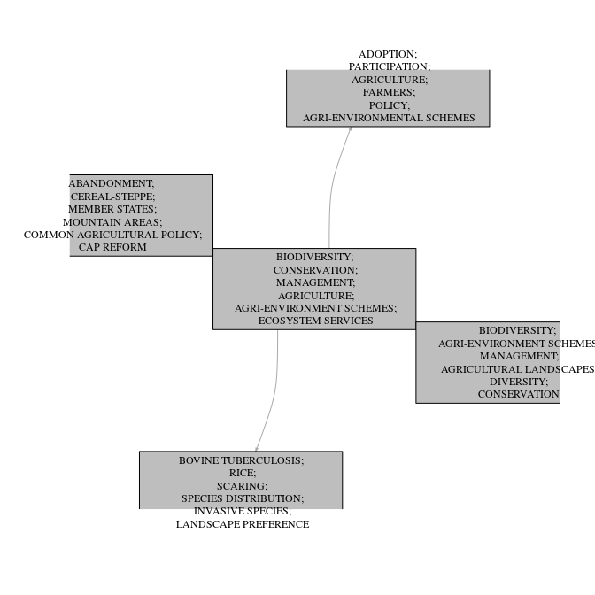
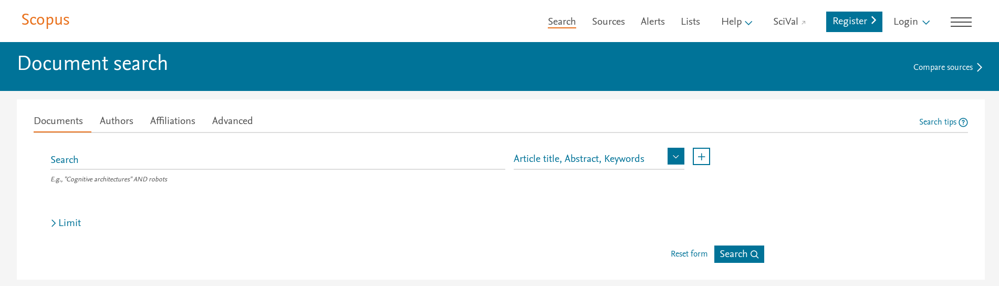
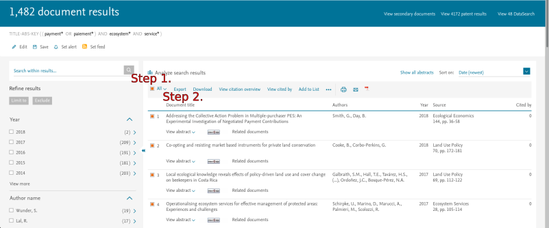
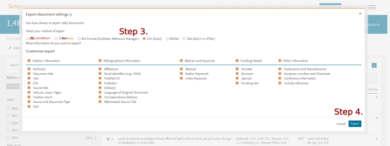
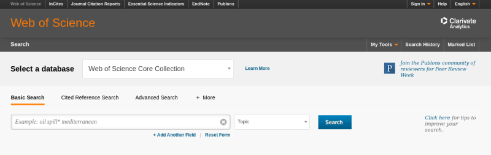
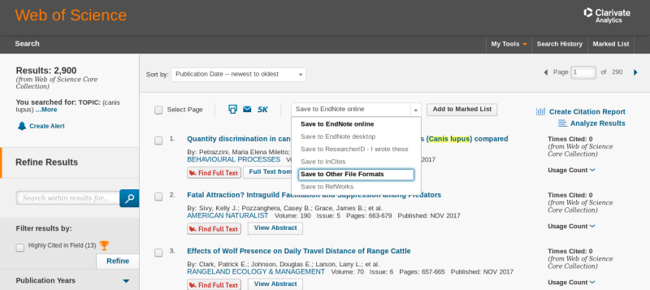
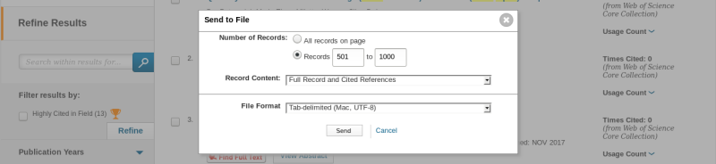
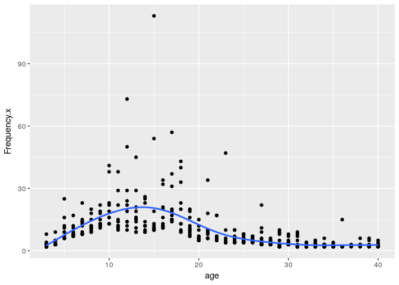

Scimeetr
================

-   [Install](#install)
-   [Introduction](#introduction)
-   [From data to reading list](#from-data-to-reading-list)
    -   [loading and exploring bibliometric data](#loading-and-exploring-bibliometric-data)
    -   [Mapping scientific community](#mapping-scientific-community)
    -   [Automatically generating a reading list of seminal papers](#automatically-generating-a-reading-list-of-seminal-papers)
-   [In depth description of each steps](#in-depth-description-of-each-steps)
    -   [How to get bibliometric data?](#how-to-get-bibliometric-data)
        -   [Retrieving data from Scopus](#retrieving-data-from-scopus)
        -   [Retrieving data from Web of Science](#retrieving-data-from-web-of-science)
    -   [How to upload bibliometric data into R](#how-to-upload-bibliometric-data-into-r)
    -   [Exploring scimeetr data](#exploring-scimeetr-data)
        -   [Printing and summary](#printing-and-summary)
        -   [Characterizing the corpus of papers contained by a scimeetr object](#characterizing-the-corpus-of-papers-contained-by-a-scimeetr-object)
            -   [Characterize the corpus with keywords](#characterize-the-corpus-with-keywords)
            -   [Characterize the corpus with journals](#characterize-the-corpus-with-journals)
            -   [Characterize the corpus with authors](#characterize-the-corpus-with-authors)
        -   [Scimeetr object structure and navigation](#scimeetr-object-structure-and-navigation)
    -   [Making reading lists](#making-reading-lists)
        -   [Core](#core)
            -   [Most cited per year](#most-cited-per-year)
            -   [More cited than expected](#more-cited-than-expected)
        -   [Experts](#experts)
            -   [Recent paper of a few experts](#recent-paper-of-a-few-experts)
            -   [Paper of experts group](#paper-of-experts-group)
        -   [Centrality](#centrality)
            -   [Betweeness](#betweeness)
            -   [Closeness](#closeness)
            -   [Connectness](#connectness)
            -   [Page rank](#page-rank)
            -   [Cite most others](#cite-most-others)
    -   [Finding the main communities of research](#finding-the-main-communities-of-research)
    -   [Focusing on a sub-community](#focusing-on-a-sub-community)
    -   [Dive to a sub-community](#dive-to-a-sub-community)

Install
=======

`scimeetr` can be installed directly from the R console using the following lines :

> if (!require("devtools")) install.packages("devtools")

> devtools::install\_github("MaximeRivest/scimeetr")

Introduction
============

Scimeetr helps explore the scholarly literature. It contains a suit of function that let someone:

-   load bibliometric data into R
-   make a map of peer reviewed papers by creating various networks
-   find research community
-   characterise the research communities
-   generate reading list

This tutorial is composed of two self-contained section. The first section show case the whole process with all the default parameters. The second section describes each function in more detail by presenting the rational for the function, the algorithms used and the options.

<a href="#top">Back to top</a>

From data to reading list
=========================

You can automatically generate a reading list of seminal papers in a research litterature by using only those three functions: `ìmport_wos_files`, `scimap`, and `scilist`. This first section describes this process in more details.

<a href="#top">Back to top</a>

loading and exploring bibliometric data
---------------------------------------

The first step in exploring the literature is to retrieve bibliometric data from the *Web of Science* or *Scopus*. In this first tutorial I use a dataset from the *Web of Science* about ecological networks.

``` r
library(scimeetr)
scimeetr_list <- import_wos_files("path/to/folder/")
```

Then,`summary` can be used to get a quick characterisation of the data.

``` r
summary(scimeetr_list)
```

    ## 
    ##  # Summary of Scimeetr #
    ## -----------------------
    ##     Number of papers:  742
    ##     Number of different reference:  28526
    ## 
    ##     Average number of reference per paper:  51
    ## 
    ##     Quantiles of total citation per paper: 
    ## 
    ##      0%     25%     50%     75%    100% 
    ##    0.00    2.00    7.00   19.75 1333.00 
    ## 
    ##     Mean number of citation per paper:  19.81536
    ## 
    ##     Average number of citation per paper per year:  1.2
    ## 
    ## 
    ##   Table of the 10 most mentionned keywords 
    ## 
    ##                       Keyword    Frequency
    ## 1                BIODIVERSITY           57
    ## 2                 AGRICULTURE           46
    ## 3  COMMON AGRICULTURAL POLICY           32
    ## 4          ECOSYSTEM SERVICES           31
    ## 5                CONSERVATION           28
    ## 6    AGRI-ENVIRONMENT SCHEMES           27
    ## 7     AGRI-ENVIRONMENT SCHEME           20
    ## 8  AGRI-ENVIRONMENTAL SCHEMES           19
    ## 9         AGRICULTURAL POLICY           18
    ## 10              WATER QUALITY           18
    ## 
    ## 
    ## 
    ##   Table of the 10 most productive journal 
    ## 
    ##                                             Journal    Frequency
    ## 1                                   LAND USE POLICY           84
    ## 2              AGRICULTURE ECOSYSTEMS & ENVIRONMENT           37
    ## 3               JOURNAL OF ENVIRONMENTAL MANAGEMENT           33
    ## 4                           BIOLOGICAL CONSERVATION           24
    ## 5                        JOURNAL OF APPLIED ECOLOGY           21
    ## 6                              ECOLOGICAL ECONOMICS           17
    ## 7                          JOURNAL OF RURAL STUDIES           17
    ## 8                              AGRICULTURAL SYSTEMS           14
    ## 9  JOURNAL OF ENVIRONMENTAL PLANNING AND MANAGEMENT           14
    ## 10                     LANDSCAPE AND URBAN PLANNING           14
    ## 
    ## 
    ## 
    ##   Table of the most descriminant keywords 
    ## 
    ##        comID                      tag
    ## 1 com1 (742)                         
    ## 2                        BIODIVERSITY
    ## 3                        CONSERVATION
    ## 4                          MANAGEMENT
    ## 5                         AGRICULTURE
    ## 6            AGRI-ENVIRONMENT SCHEMES
    ## 7                  ECOSYSTEM SERVICES

From this summary, we see that there is 396 papers in my data set which overal cites 16567 different elements. On average, each paper cites 53 elements.

Than we learn that, in this research community, 25% of the papers are cited less than 2 times, 50% are cited less than 9 times and 75% are cited less than ~23 times. There are papers that are cited up to 1333 times. The average citation per paper is ~25. This is much higher than the median (9), thus most paper are cited only a few times and a few papers are profusely cited. When correcting for the age of the paper, we learn that papers are cited 2 times per year on average.

By looking at the most frequent keyword and journals, we learn that this community of research is about biodiversity, agriculture, ecosystem services and policy. Keyword and journal frequency tables efficiently reveal the theme of a scientific community.

<a href="#top">Back to top</a>

Mapping scientific community
----------------------------

The previous characterisation is great, but it is limited if your dataset contains many different scientific communities. By detecting the scientific communities present within a dataset a map of science can be drawn and each cluster can be characterised on its own. The function `scimap` can be used for this task.

``` r
scimap_result <- scimap(scimeetr_list)
```

The function returns all the data that scimeetr\_list contained and more. For example communities have been identified and now if the function `summary` is used on scim\_result. In addition of the previous information. The descriminant keywords of each communities constituating the main community are listed.

``` r
summary(scimap_result)
```

    ## 
    ##  # Summary of Scimeetr #
    ## -----------------------
    ##     Number of papers:  742
    ##     Number of different reference:  28526
    ## 
    ##     Average number of reference per paper:  51
    ## 
    ##     Quantiles of total citation per paper: 
    ## 
    ##      0%     25%     50%     75%    100% 
    ##    0.00    2.00    7.00   19.75 1333.00 
    ## 
    ##     Mean number of citation per paper:  19.81536
    ## 
    ##     Average number of citation per paper per year:  1.2
    ## 
    ## 
    ##   Table of the 10 most mentionned keywords 
    ## 
    ##                       Keyword    Frequency
    ## 1                BIODIVERSITY           57
    ## 2                 AGRICULTURE           46
    ## 3  COMMON AGRICULTURAL POLICY           32
    ## 4          ECOSYSTEM SERVICES           31
    ## 5                CONSERVATION           28
    ## 6    AGRI-ENVIRONMENT SCHEMES           27
    ## 7     AGRI-ENVIRONMENT SCHEME           20
    ## 8  AGRI-ENVIRONMENTAL SCHEMES           19
    ## 9         AGRICULTURAL POLICY           18
    ## 10              WATER QUALITY           18
    ## 
    ## 
    ## 
    ##   Table of the 10 most productive journal 
    ## 
    ##                                             Journal    Frequency
    ## 1                                   LAND USE POLICY           84
    ## 2              AGRICULTURE ECOSYSTEMS & ENVIRONMENT           37
    ## 3               JOURNAL OF ENVIRONMENTAL MANAGEMENT           33
    ## 4                           BIOLOGICAL CONSERVATION           24
    ## 5                        JOURNAL OF APPLIED ECOLOGY           21
    ## 6                              ECOLOGICAL ECONOMICS           17
    ## 7                          JOURNAL OF RURAL STUDIES           17
    ## 8                              AGRICULTURAL SYSTEMS           14
    ## 9  JOURNAL OF ENVIRONMENTAL PLANNING AND MANAGEMENT           14
    ## 10                     LANDSCAPE AND URBAN PLANNING           14
    ## 
    ## 
    ## 
    ##   Table of the most descriminant keywords 
    ## 
    ##           comID                      tag                   ltag$tag
    ## 1    com1 (742)                                                    
    ## 2                           BIODIVERSITY                           
    ## 3                           CONSERVATION                           
    ## 4                             MANAGEMENT                           
    ## 5                            AGRICULTURE                           
    ## 6               AGRI-ENVIRONMENT SCHEMES                           
    ## 7                     ECOSYSTEM SERVICES                           
    ## 8  com1_1 (358)                                                    
    ## 9                                                          ADOPTION
    ## 10                                                    PARTICIPATION
    ## 11                                                      AGRICULTURE
    ## 12                                                          FARMERS
    ## 13                                                           POLICY
    ## 14                                       AGRI-ENVIRONMENTAL SCHEMES
    ## 15  com1_2 (49)                                                    
    ## 16                                                      ABANDONMENT
    ## 17                                                    CEREAL-STEPPE
    ## 18                                                    MEMBER STATES
    ## 19                                                   MOUNTAIN AREAS
    ## 20                                       COMMON AGRICULTURAL POLICY
    ## 21                                                       CAP REFORM
    ## 22  com1_6 (62)                                                    
    ## 23                                              BOVINE TUBERCULOSIS
    ## 24                                                             RICE
    ## 25                                                          SCARING
    ## 26                                             SPECIES DISTRIBUTION
    ## 27                                                 INVASIVE SPECIES
    ## 28                                             LANDSCAPE PREFERENCE
    ## 29 com1_3 (265)                                                    
    ## 30                                                     BIODIVERSITY
    ## 31                                         AGRI-ENVIRONMENT SCHEMES
    ## 32                                                       MANAGEMENT
    ## 33                                          AGRICULTURAL LANDSCAPES
    ## 34                                                        DIVERSITY
    ## 35                                                     CONSERVATION

Except for the last tables, all of the output is identical to the `summary` output above. Those last tables now reveals that the papers in our database can be clustered in two communities. One that is about x and the other that is about y.

The function `plot` can be used on the output of the function summary for a graphical representation of the sub-communities.

``` r
plot(summary(scimap_result, com_size = 30))
```



<a href="#top">Back to top</a>

Automatically generating a reading list of seminal papers
---------------------------------------------------------

Now that we have characterise the main community and seen of which community it is constituted, we can decide if it is the community that we wish to join / review. If it is, we use the function `scilist` to get reading lists. The defaul readin list will find the seminal papers of each communitiy.

``` r
reading_list <- scilist(scimap_result)
reading_list$com1
```

| publication                                |  metric| list\_type   |
|:-------------------------------------------|-------:|:-------------|
| KLEIJN D, 2003, J APPL ECOL, 40, 947       |     113| core\_papers |
| KLEIJN D, 2006, ECOL LETT, 9, 243          |      73| core\_papers |
| KLEIJN D, 2001, NATURE, 413, 723           |      57| core\_papers |
| BENTON TG, 2003, TRENDS ECOL EVOL, 18, 182 |      54| core\_papers |
| PANNELL DJ, 2006, AUST J EXP AGR, 46, 1407 |      50| core\_papers |

<a href="#top">Back to top</a>

In depth description of each steps
==================================

How to get bibliometric data?
-----------------------------

Biliometric data can be obtained from either *Scopus* or the *Web of Science*. Most university library have access to either one and some have access to both.

<a href="#top">Back to top</a>

### Retrieving data from Scopus



*Scopus home page.*



*Select all and export*



*Export as CSV file and select all fields for exportation*

Following the previous steps will get you one or several .csv files. Then, to import this/these file(s) in `R`, you need to put it/them in a **new folder which contains only the files to import into `R`**

<a href="#top">Back to top</a>

### Retrieving data from Web of Science



*Web of Science home page. Make sure that Select a database corresponds to Web of Science Core Collection*



*Save to Other Files Formats*



*You can download only 500 items at a time. You should select Full Record and Cited References. And select the Tab-delimeted (UTF-8) as file format.*

Following the previous steps will get you one or several .txt files. Then, to import this/these file(s) in `R`, you need to put it/them in a **new folder which contains only the files to import into `R`**

<a href="#top">Back to top</a>

How to upload bibliometric data into R
--------------------------------------

The bibliometric data obtained from Scopus or Web of science are either in .csv or .txt format. These are standard file formats and you most likely know them. There are built in function in `R` that let you import .csv and .txt files. So why does scimeetr provide you with `import_scopus_files` and `import_wos_files`? There are four reasons. The main one is that bibliometric data contains author names from around the world, which means that all alphabets are used and this leads to problems with file encoding. Scimeetr's import functions solves that problem. Second, Scopus do not provide standard, uniform and consisten cited reference list. Thus, `import_scopus_files` has to standardize it at import. This explains the additional time required to load scopus files versus wos files. Third, Scopus and Web of Science do not use the same column names so they have to be homogenized at import. Finally, the data can be transformed into a scimeetr object so that `summary`, `plot` and `print` will know what to do with it.

``` r
scimeetr_list <- import_wos_files(files_directory = "/path/to/folder/")
scimeetr_list <- import_scopus_files(files_directory = "/path/to/folder/")
```

Do not forget that this function take in a path to a folder not a file. Thus, it need a slash at the end of the folder path.

<a href="#top">Back to top</a>

Exploring scimeetr data
-----------------------

### Printing and summary

Printing `scimeetr_list` that we just created will provide some informations about it, but `summary` will provide more.

``` r
scimeetr_list
```

    ## 
    ## # A scimeetr object #
    ## ---------------------
    ## Number of papers:  742
    ## Number of communities:  1
    ## Names of communities:  com1
    ## 
    ## Table of the 5 most mentionned words 
    ## 
    ##                  key_words  title_words abstract_words
    ## 1             BIODIVERSITY CONSERVATION        FARMERS
    ## 2             CONSERVATION AGRICULTURAL   CONSERVATION
    ## 3               MANAGEMENT   MANAGEMENT   AGRICULTURAL
    ## 4              AGRICULTURE       POLICY     MANAGEMENT
    ## 5 AGRI-ENVIRONMENT SCHEMES      FARMERS         POLICY

``` r
summary(scimeetr_list)
```

    ## 
    ##  # Summary of Scimeetr #
    ## -----------------------
    ##     Number of papers:  742
    ##     Number of different reference:  28526
    ## 
    ##     Average number of reference per paper:  51
    ## 
    ##     Quantiles of total citation per paper: 
    ## 
    ##      0%     25%     50%     75%    100% 
    ##    0.00    2.00    7.00   19.75 1333.00 
    ## 
    ##     Mean number of citation per paper:  19.81536
    ## 
    ##     Average number of citation per paper per year:  1.2
    ## 
    ## 
    ##   Table of the 10 most mentionned keywords 
    ## 
    ##                       Keyword    Frequency
    ## 1                BIODIVERSITY           57
    ## 2                 AGRICULTURE           46
    ## 3  COMMON AGRICULTURAL POLICY           32
    ## 4          ECOSYSTEM SERVICES           31
    ## 5                CONSERVATION           28
    ## 6    AGRI-ENVIRONMENT SCHEMES           27
    ## 7     AGRI-ENVIRONMENT SCHEME           20
    ## 8  AGRI-ENVIRONMENTAL SCHEMES           19
    ## 9         AGRICULTURAL POLICY           18
    ## 10              WATER QUALITY           18
    ## 
    ## 
    ## 
    ##   Table of the 10 most productive journal 
    ## 
    ##                                             Journal    Frequency
    ## 1                                   LAND USE POLICY           84
    ## 2              AGRICULTURE ECOSYSTEMS & ENVIRONMENT           37
    ## 3               JOURNAL OF ENVIRONMENTAL MANAGEMENT           33
    ## 4                           BIOLOGICAL CONSERVATION           24
    ## 5                        JOURNAL OF APPLIED ECOLOGY           21
    ## 6                              ECOLOGICAL ECONOMICS           17
    ## 7                          JOURNAL OF RURAL STUDIES           17
    ## 8                              AGRICULTURAL SYSTEMS           14
    ## 9  JOURNAL OF ENVIRONMENTAL PLANNING AND MANAGEMENT           14
    ## 10                     LANDSCAPE AND URBAN PLANNING           14
    ## 
    ## 
    ## 
    ##   Table of the most descriminant keywords 
    ## 
    ##        comID                      tag
    ## 1 com1 (742)                         
    ## 2                        BIODIVERSITY
    ## 3                        CONSERVATION
    ## 4                          MANAGEMENT
    ## 5                         AGRICULTURE
    ## 6            AGRI-ENVIRONMENT SCHEMES
    ## 7                  ECOSYSTEM SERVICES

### Characterizing the corpus of papers contained by a scimeetr object

Within the scimeetr package there are several function that help us characterize our corpus of papers.

The corpus of papers can be characterized be:

-   keywords with `characterize_kw()`
-   title-words with `characterize_ti()`
-   astract-words with `characterize_ab()`
-   journals with `characterize_jo()`
-   authors with `characterize_au()`
-   universities with `characterize_un()`
-   countries with `characterize_co()`

#### Characterize the corpus with keywords

To get even more information about the corpus of papers contained within `scimeetr_list` we can use `characterize_kw`. This function will generate a list of data frames, one data frame per communities within `scimeetr_list`. The first column of any of these data frames will contain the keywords themselves. The second column contains the frequency of the keywords (i.e. the number of papers that mentions this keyword).

``` r
kw <- characterize_kw(scimeetr_list)
head(kw$com1)
```

| keyword                    |  id\_and\_de\_frequency|  de\_frequency|  id\_frequency|
|:---------------------------|-----------------------:|--------------:|--------------:|
| BIODIVERSITY               |                     182|             57|            125|
| AGRICULTURE                |                     112|             46|             66|
| COMMON AGRICULTURAL POLICY |                      40|             32|              8|
| ECOSYSTEM SERVICES         |                      76|             31|             45|
| CONSERVATION               |                     155|             28|            127|
| AGRI-ENVIRONMENT SCHEMES   |                     103|             27|             76|

<a href="#top">Back to top</a>

#### Characterize the corpus with journals

We can also use `characterize_jo`. Just like `characterize_kw`, this function will generate a list of data frames, one data frame per communities within `scimeetr_list`. The first column of any of these data frames will contain the journals' names themselves. The other columns contains several journal based metrics.

``` r
jo <- characterize_jo(scimeetr_list)
head(jo$com1)
```

| journal             |  citations|    H|  impact\_factor|  papers\_cited|  papers\_within\_com|
|:--------------------|----------:|----:|---------------:|--------------:|--------------------:|
| J APPL ECOL         |        841|   13|        5.461039|            154|                   21|
| LAND USE POLICY     |        533|   12|        4.801802|            111|                   84|
| AGR ECOSYST ENVIRON |        574|   10|        3.610063|            159|                   37|
| J ENVIRON MANAGE    |        445|   10|        5.493827|             81|                   33|
| J RURAL STUD        |        522|   10|        5.381443|             97|                   17|
| SCIENCE             |        218|    9|        4.739130|             46|                   NA|

<a href="#top">Back to top</a>

#### Characterize the corpus with authors

We can also use `characterize_au`. The first column of any of these data frames will contain the authors' names themselves. The other columns contains several author based metrics.

``` r
au <- characterize_au(scimeetr_list)
head(au$com1)
```

<table>
<colgroup>
<col width="11%" />
<col width="4%" />
<col width="3%" />
<col width="3%" />
<col width="3%" />
<col width="9%" />
<col width="10%" />
<col width="9%" />
<col width="12%" />
<col width="17%" />
<col width="12%" />
</colgroup>
<thead>
<tr class="header">
<th align="left">AU</th>
<th align="right">HHL</th>
<th align="right">HH</th>
<th align="right">HL</th>
<th align="right">H</th>
<th align="right">Local_cit</th>
<th align="right">Global_cit</th>
<th align="right">nb_papers</th>
<th align="right">local2global</th>
<th align="right">fa_nb_paper_cited</th>
<th align="right">fa_total_cit</th>
</tr>
</thead>
<tbody>
<tr class="odd">
<td align="left">HERZOG F</td>
<td align="right">6</td>
<td align="right">10</td>
<td align="right">4</td>
<td align="right">9</td>
<td align="right">57</td>
<td align="right">293</td>
<td align="right">12</td>
<td align="right">0.1945392</td>
<td align="right">5</td>
<td align="right">32</td>
</tr>
<tr class="even">
<td align="left">MATZDORF B</td>
<td align="right">5</td>
<td align="right">6</td>
<td align="right">3</td>
<td align="right">5</td>
<td align="right">52</td>
<td align="right">138</td>
<td align="right">7</td>
<td align="right">0.3768116</td>
<td align="right">5</td>
<td align="right">41</td>
</tr>
<tr class="odd">
<td align="left">SCHUPBACH B</td>
<td align="right">5</td>
<td align="right">8</td>
<td align="right">4</td>
<td align="right">7</td>
<td align="right">42</td>
<td align="right">274</td>
<td align="right">9</td>
<td align="right">0.1532847</td>
<td align="right">1</td>
<td align="right">5</td>
</tr>
<tr class="even">
<td align="left">BURTON RJF</td>
<td align="right">4</td>
<td align="right">5</td>
<td align="right">3</td>
<td align="right">5</td>
<td align="right">43</td>
<td align="right">166</td>
<td align="right">5</td>
<td align="right">0.2590361</td>
<td align="right">11</td>
<td align="right">154</td>
</tr>
<tr class="odd">
<td align="left">DRECHSLER M</td>
<td align="right">4</td>
<td align="right">5</td>
<td align="right">2</td>
<td align="right">4</td>
<td align="right">20</td>
<td align="right">64</td>
<td align="right">5</td>
<td align="right">0.3125000</td>
<td align="right">7</td>
<td align="right">33</td>
</tr>
<tr class="even">
<td align="left">JEANNERET P</td>
<td align="right">4</td>
<td align="right">6</td>
<td align="right">4</td>
<td align="right">5</td>
<td align="right">25</td>
<td align="right">143</td>
<td align="right">6</td>
<td align="right">0.1748252</td>
<td align="right">3</td>
<td align="right">10</td>
</tr>
</tbody>
</table>

<a href="#top">Back to top</a>

### Scimeetr object structure and navigation

A scimeetr object such as `scimeetr_list` contains more data than what can be seen with `print` and `summary`. A scimeetr object is in fact a list of communities list which are themselves list of up to 9 elements. Each communities contain a data.frame called `dfsci`. This dataframe contains all the bibliometric data that was importedinto `R`.

``` r
scimeetr_list$com1$dfsci
```

<table style="width:100%;">
<colgroup>
<col width="0%" />
<col width="4%" />
<col width="0%" />
<col width="0%" />
<col width="0%" />
<col width="5%" />
<col width="0%" />
<col width="0%" />
<col width="5%" />
<col width="2%" />
<col width="0%" />
<col width="0%" />
<col width="0%" />
<col width="0%" />
<col width="0%" />
<col width="0%" />
<col width="0%" />
<col width="0%" />
<col width="0%" />
<col width="7%" />
<col width="6%" />
<col width="16%" />
<col width="7%" />
<col width="2%" />
<col width="0%" />
<col width="0%" />
<col width="11%" />
<col width="0%" />
<col width="0%" />
<col width="0%" />
<col width="0%" />
<col width="0%" />
<col width="0%" />
<col width="0%" />
<col width="2%" />
<col width="0%" />
<col width="0%" />
<col width="0%" />
<col width="1%" />
<col width="1%" />
<col width="0%" />
<col width="0%" />
<col width="0%" />
<col width="0%" />
<col width="0%" />
<col width="0%" />
<col width="0%" />
<col width="0%" />
<col width="0%" />
<col width="0%" />
<col width="0%" />
<col width="1%" />
<col width="0%" />
<col width="0%" />
<col width="2%" />
<col width="3%" />
<col width="0%" />
<col width="1%" />
<col width="0%" />
<col width="3%" />
</colgroup>
<thead>
<tr class="header">
<th align="left">PT</th>
<th align="left">AU</th>
<th align="left">BA</th>
<th align="left">BE</th>
<th align="left">GP</th>
<th align="left">AF</th>
<th align="left">BF</th>
<th align="left">CA</th>
<th align="left">TI</th>
<th align="left">SO</th>
<th align="left">SE</th>
<th align="left">BS</th>
<th align="left">LA</th>
<th align="left">DT</th>
<th align="left">CT</th>
<th align="left">CY</th>
<th align="left">CL</th>
<th align="left">SP</th>
<th align="left">HO</th>
<th align="left">DE</th>
<th align="left">ID</th>
<th align="left">C1</th>
<th align="left">RP</th>
<th align="left">EM</th>
<th align="left">RI</th>
<th align="left">OI</th>
<th align="left">FU</th>
<th align="right">NR</th>
<th align="right">TC</th>
<th align="right">Z9</th>
<th align="right">U1</th>
<th align="right">U2</th>
<th align="left">PU</th>
<th align="left">PI</th>
<th align="left">PA</th>
<th align="left">SN</th>
<th align="left">EI</th>
<th align="left">BN</th>
<th align="left">J9</th>
<th align="left">JI</th>
<th align="left">PD</th>
<th align="right">PY</th>
<th align="left">VL</th>
<th align="left">IS</th>
<th align="left">PN</th>
<th align="left">SU</th>
<th align="left">SI</th>
<th align="left">MA</th>
<th align="left">BP</th>
<th align="left">EP</th>
<th align="left">AR</th>
<th align="left">DI</th>
<th align="left">D2</th>
<th align="right">PG</th>
<th align="left">WC</th>
<th align="left">SC</th>
<th align="left">GA</th>
<th align="left">UT</th>
<th align="right">PM</th>
<th align="left">RECID</th>
</tr>
</thead>
<tbody>
<tr class="odd">
<td align="left">J</td>
<td align="left">Holstead, KL; Kenyon, W; Rouillard, JJ; Hopkins, J; Galan-Diaz, C</td>
<td align="left">NA</td>
<td align="left">NA</td>
<td align="left">NA</td>
<td align="left">Holstead, K. L.; Kenyon, W.; Rouillard, J. J.; Hopkins, J.; Galan-Diaz, C.</td>
<td align="left">NA</td>
<td align="left"></td>
<td align="left">Natural flood management from the farmer's perspective: criteria that affect uptake</td>
<td align="left">JOURNAL OF FLOOD RISK MANAGEMENT</td>
<td align="left">NA</td>
<td align="left">NA</td>
<td align="left">English</td>
<td align="left">Article</td>
<td align="left"></td>
<td align="left"></td>
<td align="left"></td>
<td align="left"></td>
<td align="left"></td>
<td align="left">Natural flood management; catchment management; flood risk management; farmer decision making; land use change</td>
<td align="left">DECISION-MAKING; BEHAVIOR; CONSERVATIONISTS; PARTICIPATION; ATTITUDES; SCHEMES; ENGLAND</td>
<td align="left">[Holstead, K. L.; Kenyon, W.; Hopkins, J.] James Hutton Inst, Social Econ &amp; Geog Sci Grp, Aberdeen AB15 8QH, Scotland; [Rouillard, J. J.] Univ Dundee, Sch Environm, Dundee, Scotland; [Galan-Diaz, C.] Dot Rural Univ Aberdeen, Aberdeen, Scotland</td>
<td align="left">Holstead, KL (reprint author), James Hutton Inst, Social Econ &amp; Geog Sci Grp, Aberdeen AB15 8QH, Scotland.</td>
<td align="left"><a href="mailto:kirsty.holstead@hutton.ac.uk">kirsty.holstead@hutton.ac.uk</a></td>
<td align="left"></td>
<td align="left"></td>
<td align="left">Scottish Government's Rural and Environment Science and Analytical Services (RESAS) Division, Work Package 2.4: Methods for mitigating and adapting to flood risk</td>
<td align="right">59</td>
<td align="right">2</td>
<td align="right">2</td>
<td align="right">0</td>
<td align="right">0</td>
<td align="left">WILEY</td>
<td align="left">HOBOKEN</td>
<td align="left">111 RIVER ST, HOBOKEN 07030-5774, NJ USA</td>
<td align="left">1753-318X</td>
<td align="left"></td>
<td align="left">NA</td>
<td align="left">J FLOOD RISK MANAG</td>
<td align="left">J. Flood Risk Manag.</td>
<td align="left">JUN</td>
<td align="right">2017</td>
<td align="left">10</td>
<td align="left">2</td>
<td align="left"></td>
<td align="left">NA</td>
<td align="left">SI</td>
<td align="left">NA</td>
<td align="left">205</td>
<td align="left">218</td>
<td align="left"></td>
<td align="left">10.1111/jfr3.12129</td>
<td align="left">NA</td>
<td align="right">14</td>
<td align="left">Environmental Sciences; Water Resources</td>
<td align="left">Environmental Sciences &amp; Ecology; Water Resources</td>
<td align="left">EU4HB</td>
<td align="left">WOS:000400989300008</td>
<td align="right">NA</td>
<td align="left">HOLSTEAD KL, 2017, J FLOOD RISK MANAG, 10, 205</td>
</tr>
</tbody>
</table>

<a href="#top">Back to top</a>

Making reading lists
--------------------

If we are confident that the papers contained in `scimeetr_list` are those for which we want a reading list we can used the function `scilist` to find various lists of papers. The default list given by `scilist` contains the seminal papers for the community analysed. That is, it rank the paper by the number of times they were cited by all the papers and list them by citation frequency.

``` r
scilist(scimeetr_list)
```

| publication                                |  metric| list\_type   |
|:-------------------------------------------|-------:|:-------------|
| KLEIJN D, 2003, J APPL ECOL, 40, 947       |     113| core\_papers |
| KLEIJN D, 2006, ECOL LETT, 9, 243          |      73| core\_papers |
| KLEIJN D, 2001, NATURE, 413, 723           |      57| core\_papers |
| BENTON TG, 2003, TRENDS ECOL EVOL, 18, 182 |      54| core\_papers |
| PANNELL DJ, 2006, AUST J EXP AGR, 46, 1407 |      50| core\_papers |

With the parameter `k`, we can control the length of the reading list.

``` r
scilist(scimeetr_list, k = 3)
```

| publication                          |  metric| list\_type   |
|:-------------------------------------|-------:|:-------------|
| KLEIJN D, 2003, J APPL ECOL, 40, 947 |     113| core\_papers |
| KLEIJN D, 2006, ECOL LETT, 9, 243    |      73| core\_papers |
| KLEIJN D, 2001, NATURE, 413, 723     |      57| core\_papers |

With the parameter `reading_list`, we can get any of the following 12 reading lists that fits into three categories:

-   Core
    -   core\_papers
    -   core\_yr
    -   core\_residual
-   Experts
    -   by\_expert\_LC
    -   by\_expert\_TC
    -   group\_of\_experts\_TC
    -   group\_of\_experts\_LC
-   Centrality
    -   cite\_most\_others
    -   betweeness
    -   closeness
    -   connectness
    -   page\_rank

The default reading list is `core_papers`.

<a href="#top">Back to top</a>

### Core

I categorise the reading lists as **core** because they are reading lists of core papers as they are all a variation of the number of times papers within our community of interest refers to the paper listed. Although the number of citation is not a perfect measure of a papers importance for a community it should be a good proxy. A weekness of the number of citation as a measure of papers importance is that not all citations are equal. For example, sometimes a paper is cited because it is criticized or because it contrasts with other findings. This as been realised by others before and some have attempted to fix it by creating the concept of influential citation. Influential citation is a great concept by to be calculated it requires advance text processing and access to the full text of each papers. As it is notoriosly time consuming to get full text and even harder to get it in the right format, we are left with citation count.

#### Most cited per year

Using `scilist` with `reading_list = "core_yr"` will list the most cited paper for each year from three years before present to ten years before present. The parameter `k` controls the number of paper per year to list.

``` r
scilist(scimeetr_list, reading_list = "core_yr", k = 2)
```

| publication                                            |  metric| list\_type |
|:-------------------------------------------------------|-------:|:-----------|
| GILL RJ, 2016, ADV ECOL RES, 54, 135                   |       2| core\_yr   |
| KARPOVICH D., 2016, SAGINAW BAY OPTIMIZA               |       2| core\_yr   |
| PEREIRA P, 2016, LAND DEGRAD DEV, 27, 871              |       2| core\_yr   |
| SIMONSEN CE, 2016, J APPL ECOL, 53, 916                |       2| core\_yr   |
| BATARY P, 2015, CONSERV BIOL, 29, 1006                 |       8| core\_yr   |
| PRAGER K, 2015, CURR OPIN ENV SUST, 12, 59             |       4| core\_yr   |
| SCHOMERS S, 2015, LAND USE POLICY, 42, 58              |       4| core\_yr   |
| PE'ER G, 2014, SCIENCE, 344, 1090                      |       9| core\_yr   |
| MEICHTRY-STIER KS, 2014, AGR ECOSYST ENVIRON, 189, 101 |       5| core\_yr   |
| RIBEIRO PF, 2014, AGR ECOSYST ENVIRON, 183, 138        |       5| core\_yr   |
| BURTON RJF, 2013, LAND USE POLICY, 30, 628             |      25| core\_yr   |
| UTHES S, 2013, ENVIRON MANAGE, 51, 251                 |      16| core\_yr   |
| BAUMGART-GETZ A, 2012, J ENVIRON MANAGE, 96, 17        |      17| core\_yr   |
| EMERY SB, 2012, J RURAL STUD, 28, 218                  |      12| core\_yr   |

<a href="#top">Back to top</a>

#### More cited than expected

Using `scilist` with `reading_list = "core_residual"` will list the papers that diverge most from the expected number of citation for this particular paper. This can be visualised in the figure below. The point that have the biggest difference between their frequency value and the fitted blue lines are listed in the `core_residual` reading list. 

Here is an example of the code and its result.

``` r
scilist(scimeetr_list, reading_list = "core_residual", k = 3)
```

| publication                          |  metric| list\_type     |
|:-------------------------------------|-------:|:---------------|
| KLEIJN D, 2003, J APPL ECOL, 40, 947 |     113| core\_residual |
| MORRIS C, 1995, J RURAL STUD, 11, 51 |      47| core\_residual |
| ERVIN CA, 1982, LAND ECON, 58, 277   |      15| core\_residual |

<a href="#top">Back to top</a>

### Experts

The reading lists that I categorise as **expert** are built from authors information. Experts within a community are identified based on the number of papers they published and the number of times each of their papers are cited.

#### Recent paper of a few experts

Using `scilist` with `reading_list = "by_expert_LC"` we will get a list of recent papers by one or a few experts in the community. For the option `by_expert_LC`, authors are ranked based on their *harmonic local H-index*. The H-index is a measure of an other productivity and impact. An author with an H-index of 10 means that he has published at least 10 papers with 10 or more citation each. A local H-index means that only citations from other papers in the community are counted. A harmonic local H-index means that authors do not get the full credit for each citation their paper received. It is corrected depending on the authos position in the authors list. First authors gets most of the credit, then the last author gets the second most, and the authors gets credit as a proportion of their position. Once the authors harmonic-local-H-index is found they are ranked and the `m` most recent publication of the `k` most 'expert' authors are listed as a reading list.

``` r
scilist(scimeetr_list, reading_list = "by_expert_LC", k = 2, m = 2)
```

<table>
<colgroup>
<col width="54%" />
<col width="30%" />
<col width="15%" />
</colgroup>
<thead>
<tr class="header">
<th align="left">publication</th>
<th align="left">metric</th>
<th align="left">list_type</th>
</tr>
</thead>
<tbody>
<tr class="odd">
<td align="left">SEREKE F, 2015, AGRON SUSTAIN DEV, 35, 759</td>
<td align="left">Herzog, F h-index : 6</td>
<td align="left">by_expert_LC</td>
</tr>
<tr class="even">
<td align="left">KELEMEN E, 2013, LAND USE POLICY, 35, 318</td>
<td align="left">Herzog, F h-index : 6</td>
<td align="left">by_expert_LC</td>
</tr>
<tr class="odd">
<td align="left">MEYER C, 2016, LAND USE POLICY, 55, 352</td>
<td align="left">Matzdorf, B h-index : 5</td>
<td align="left">by_expert_LC</td>
</tr>
<tr class="even">
<td align="left">SCHOMERS S, 2015, SUSTAINABILITY-BASEL, 7, 13856</td>
<td align="left">Matzdorf, B h-index : 5</td>
<td align="left">by_expert_LC</td>
</tr>
<tr class="odd">
<td align="left">SCHOMERS S, 2015, LAND USE POLICY, 42, 58</td>
<td align="left">Matzdorf, B h-index : 5</td>
<td align="left">by_expert_LC</td>
</tr>
<tr class="even">
<td align="left">SCHUPBACH B, 2016, LAND USE POLICY, 53, 27</td>
<td align="left">Schupbach, B h-index : 5</td>
<td align="left">by_expert_LC</td>
</tr>
<tr class="odd">
<td align="left">AVIRON S, 2011, RESTOR ECOL, 19, 500</td>
<td align="left">Schupbach, B h-index : 5</td>
<td align="left">by_expert_LC</td>
</tr>
<tr class="even">
<td align="left">JUNGE X, 2011, BIOL CONSERV, 144, 1430</td>
<td align="left">Schupbach, B h-index : 5</td>
<td align="left">by_expert_LC</td>
</tr>
</tbody>
</table>

Using `scilist` with `reading_list = "by_expert_TC"` instead of `reading_list = "by_expert_LC"`, notice the `_TC` instead of the `_LC` will based the ranking calculation on **t**otal citation of it's publications instead of only the **l**ocal citations.

<a href="#top">Back to top</a>

#### Paper of experts group

Using `scilist` with `reading_list = "group_of_experts_LC"` we will get a list of papers for which many authors are experts in the community. For this option, authors are assigned a *harmonic local H-index* like described in the previous section. But this time, a weighted sum of the harmonic-local-H-index of each authors of a paper is calculated.

``` r
scilist(scimeetr_list, reading_list = "group_of_experts_LC", k = 5)
```

| publication                                   |    metric| list\_type             |
|:----------------------------------------------|---------:|:-----------------------|
| HERZOG F, 2005, AGR ECOSYST ENVIRON, 108, 189 |  8.678571| group\_of\_experts\_LC |
| AVIRON S, 2011, RESTOR ECOL, 19, 500          |  8.383333| group\_of\_experts\_LC |
| AVIRON S, 2007, AGR ECOSYST ENVIRON, 122, 295 |  8.166667| group\_of\_experts\_LC |
| AVIRON S, 2005, GRASSLAND SCI EUR, 10, 340    |  7.955952| group\_of\_experts\_LC |
| KAMPMANN D, 2008, J NAT CONSERV, 16, 12       |  7.926190| group\_of\_experts\_LC |

Using `scilist` with `reading_list = "group_of_experts_TC"` instead of `reading_list = "group_of_experts_LC"`, notice the `_TC` instead of the `_LC` will based the ranking calculation on **t**otal citation of it's publications instead of only the **l**ocal citations.

<a href="#top">Back to top</a>

### Centrality

Their are several measures of [nodes centrality in graph theory](https://en.wikipedia.org/wiki/Centrality). The most central papers of a community of papers can be found with `scilist`.

#### Betweeness

Betweeness measures the importance of a paper in connecting two clusters of papers. Papers with a high betweeness would therefore be a paper that tend to be more interdisciplinary.

``` r
scilist(scimeetr_list, reading_list = "betweeness", k = 5)
```

| publication                                  |     metric| list\_type |
|:---------------------------------------------|----------:|:-----------|
| UTHES S, 2013, ENVIRON MANAGE, 51, 251       |  0.4474377| betweeness |
| FISCHER J, 2012, CONSERV LETT, 5, 167        |  0.4051355| betweeness |
| JARVIS DI, 2011, CRIT REV PLANT SCI, 30, 125 |  0.2773863| betweeness |
| XIONG Y, 2010, J GEOGR SCI, 20, 389          |  0.1677135| betweeness |
| WADE MR, 2008, PHILOS T R SOC B, 363, 831    |  0.1211110| betweeness |

<a href="#top">Back to top</a>

#### Closeness

Closeness measures the average number of link between a paper and all other papers. Papers with a high closeness would therefore be a paper that tend to have a large and wide list of citations.

``` r
scilist(scimeetr_list, reading_list = "closeness", k = 5)
```

| publication                                  |     metric| list\_type |
|:---------------------------------------------|----------:|:-----------|
| UTHES S, 2013, ENVIRON MANAGE, 51, 251       |  0.0327660| closeness  |
| FISCHER J, 2012, CONSERV LETT, 5, 167        |  0.0327537| closeness  |
| JARVIS DI, 2011, CRIT REV PLANT SCI, 30, 125 |  0.0327450| closeness  |
| XIONG Y, 2010, J GEOGR SCI, 20, 389          |  0.0327312| closeness  |
| WADE MR, 2008, PHILOS T R SOC B, 363, 831    |  0.0327184| closeness  |

<a href="#top">Back to top</a>

#### Connectness

Connectness measures the number of links a paper has. Papers with a high connectness would therefore be a paper that tend to have cited what most other studies cited.

``` r
scilist(scimeetr_list, reading_list = "connectness", k = 5)
```

| publication                                     |  metric| list\_type  |
|:------------------------------------------------|-------:|:------------|
| METTEPENNINGEN E, 2013, LAND USE POLICY, 33, 20 |     341| connectness |
| GUILLEM EE, 2013, LAND USE POLICY, 31, 565      |     317| connectness |
| UTHES S, 2013, ENVIRON MANAGE, 51, 251          |     305| connectness |
| BURTON RJF, 2013, LAND USE POLICY, 30, 628      |     305| connectness |
| WADE MR, 2008, PHILOS T R SOC B, 363, 831       |     295| connectness |

<a href="#top">Back to top</a>

#### Page rank

[Page rank](https://en.wikipedia.org/wiki/PageRank) was developped by Larry Page at google and it's a way to measure web page importance. The algorithm was applied to directed graph, so I am not sure of the consequence of applying it on the undirected graph that we have here.

``` r
scilist(scimeetr_list, reading_list = "page_rank", k = 5)
```

<table>
<colgroup>
<col width="72%" />
<col width="13%" />
<col width="13%" />
</colgroup>
<thead>
<tr class="header">
<th align="left">publication</th>
<th align="right">metric</th>
<th align="left">list_type</th>
</tr>
</thead>
<tbody>
<tr class="odd">
<td align="left">MORRIS C, 2004, LAND USE POLICY, 21, 177</td>
<td align="right">0.0355645</td>
<td align="left">page_rank</td>
</tr>
<tr class="even">
<td align="left">MATHIJS E, 2003, OUTLOOK AGR, 32, 13</td>
<td align="right">0.0288389</td>
<td align="left">page_rank</td>
</tr>
<tr class="odd">
<td align="left">LINDEMANN-MATTHIES P, 2010, LANDSCAPE URBAN PLAN, 98, 99</td>
<td align="right">0.0256324</td>
<td align="left">page_rank</td>
</tr>
<tr class="even">
<td align="left">WATZOLD F, 2010, BIODIVERS CONSERV, 19, 2053</td>
<td align="right">0.0249663</td>
<td align="left">page_rank</td>
</tr>
<tr class="odd">
<td align="left">HERZOG F, 2005, AGR ECOSYST ENVIRON, 108, 175</td>
<td align="right">0.0221489</td>
<td align="left">page_rank</td>
</tr>
</tbody>
</table>

<a href="#top">Back to top</a>

#### Cite most others

With the option `cite_most_others`, the papers that cite most other papers of the community can be found. This is not a centrality measure but it is also based on papers connection to each other. It should tend to find litterature review and recent papers that have an especially good grasp on the community.

``` r
scilist(scimeetr_list, reading_list = "cite_most_others", k = 5)
```

| publication                                      |  metric| list\_type         |
|:-------------------------------------------------|-------:|:-------------------|
| UTHES S, 2013, ENVIRON MANAGE, 51, 251           |      24| cite\_most\_others |
| HEJNOWICZ AP, 2016, LAND USE POLICY, 55, 240     |      16| cite\_most\_others |
| SCHOMERS S, 2015, SUSTAINABILITY-BASEL, 7, 13856 |      13| cite\_most\_others |
| SCHOMERS S, 2015, LAND USE POLICY, 42, 58        |      12| cite\_most\_others |
| DEDEURWAERDERE T, 2015, ECOL ECON, 119, 24       |      11| cite\_most\_others |

<a href="#top">Back to top</a>

Finding the main communities of research
----------------------------------------

In the previous sections we have looked at only the main research community. But, splitting the main community in sub-communities can provide a more detail picture of the litterature. It can also help identify and then remove irrelevant sub-communities. To achieve any of this, the sub-communities have to be identified and characterized. The function `scimap`, as in science map, was developped for this task. By default, the graph use bibliographic coupling to calculate connections between papers, but coupling can also be done based on abstract words (abc), title words (tic) or keywords (kec).

``` r
summary(scimap(scimeetr_list, coupling_by = 'bic', community_algorithm = 'louvain', min_com_size = 100))
```

    ## 
    ##  # Summary of Scimeetr #
    ## -----------------------
    ##     Number of papers:  742
    ##     Number of different reference:  28526
    ## 
    ##     Average number of reference per paper:  51
    ## 
    ##     Quantiles of total citation per paper: 
    ## 
    ##      0%     25%     50%     75%    100% 
    ##    0.00    2.00    7.00   19.75 1333.00 
    ## 
    ##     Mean number of citation per paper:  19.81536
    ## 
    ##     Average number of citation per paper per year:  1.2
    ## 
    ## 
    ##   Table of the 10 most mentionned keywords 
    ## 
    ##                       Keyword    Frequency
    ## 1                BIODIVERSITY           57
    ## 2                 AGRICULTURE           46
    ## 3  COMMON AGRICULTURAL POLICY           32
    ## 4          ECOSYSTEM SERVICES           31
    ## 5                CONSERVATION           28
    ## 6    AGRI-ENVIRONMENT SCHEMES           27
    ## 7     AGRI-ENVIRONMENT SCHEME           20
    ## 8  AGRI-ENVIRONMENTAL SCHEMES           19
    ## 9         AGRICULTURAL POLICY           18
    ## 10              WATER QUALITY           18
    ## 
    ## 
    ## 
    ##   Table of the 10 most productive journal 
    ## 
    ##                                             Journal    Frequency
    ## 1                                   LAND USE POLICY           84
    ## 2              AGRICULTURE ECOSYSTEMS & ENVIRONMENT           37
    ## 3               JOURNAL OF ENVIRONMENTAL MANAGEMENT           33
    ## 4                           BIOLOGICAL CONSERVATION           24
    ## 5                        JOURNAL OF APPLIED ECOLOGY           21
    ## 6                              ECOLOGICAL ECONOMICS           17
    ## 7                          JOURNAL OF RURAL STUDIES           17
    ## 8                              AGRICULTURAL SYSTEMS           14
    ## 9  JOURNAL OF ENVIRONMENTAL PLANNING AND MANAGEMENT           14
    ## 10                     LANDSCAPE AND URBAN PLANNING           14
    ## 
    ## 
    ## 
    ##   Table of the most descriminant keywords 
    ## 
    ##           comID                      tag                   ltag$tag
    ## 1    com1 (742)                                                    
    ## 2                           BIODIVERSITY                           
    ## 3                           CONSERVATION                           
    ## 4                             MANAGEMENT                           
    ## 5                            AGRICULTURE                           
    ## 6               AGRI-ENVIRONMENT SCHEMES                           
    ## 7                     ECOSYSTEM SERVICES                           
    ## 8  com1_1 (358)                                                    
    ## 9                                                          ADOPTION
    ## 10                                                    PARTICIPATION
    ## 11                                                      AGRICULTURE
    ## 12                                                          FARMERS
    ## 13                                                           POLICY
    ## 14                                       AGRI-ENVIRONMENTAL SCHEMES
    ## 15 com1_3 (265)                                                    
    ## 16                                                     BIODIVERSITY
    ## 17                                         AGRI-ENVIRONMENT SCHEMES
    ## 18                                                       MANAGEMENT
    ## 19                                          AGRICULTURAL LANDSCAPES
    ## 20                                                        DIVERSITY
    ## 21                                                     CONSERVATION

``` r
summary(scimap(scimeetr_list, coupling_by = 'abc', community_algorithm = 'louvain', min_com_size = 100))
```

    ## 
    ##  # Summary of Scimeetr #
    ## -----------------------
    ##     Number of papers:  742
    ##     Number of different reference:  28526
    ## 
    ##     Average number of reference per paper:  51
    ## 
    ##     Quantiles of total citation per paper: 
    ## 
    ##      0%     25%     50%     75%    100% 
    ##    0.00    2.00    7.00   19.75 1333.00 
    ## 
    ##     Mean number of citation per paper:  19.81536
    ## 
    ##     Average number of citation per paper per year:  1.2
    ## 
    ## 
    ##   Table of the 10 most mentionned keywords 
    ## 
    ##                       Keyword    Frequency
    ## 1                BIODIVERSITY           57
    ## 2                 AGRICULTURE           46
    ## 3  COMMON AGRICULTURAL POLICY           32
    ## 4          ECOSYSTEM SERVICES           31
    ## 5                CONSERVATION           28
    ## 6    AGRI-ENVIRONMENT SCHEMES           27
    ## 7     AGRI-ENVIRONMENT SCHEME           20
    ## 8  AGRI-ENVIRONMENTAL SCHEMES           19
    ## 9         AGRICULTURAL POLICY           18
    ## 10              WATER QUALITY           18
    ## 
    ## 
    ## 
    ##   Table of the 10 most productive journal 
    ## 
    ##                                             Journal    Frequency
    ## 1                                   LAND USE POLICY           84
    ## 2              AGRICULTURE ECOSYSTEMS & ENVIRONMENT           37
    ## 3               JOURNAL OF ENVIRONMENTAL MANAGEMENT           33
    ## 4                           BIOLOGICAL CONSERVATION           24
    ## 5                        JOURNAL OF APPLIED ECOLOGY           21
    ## 6                              ECOLOGICAL ECONOMICS           17
    ## 7                          JOURNAL OF RURAL STUDIES           17
    ## 8                              AGRICULTURAL SYSTEMS           14
    ## 9  JOURNAL OF ENVIRONMENTAL PLANNING AND MANAGEMENT           14
    ## 10                     LANDSCAPE AND URBAN PLANNING           14
    ## 
    ## 
    ## 
    ##   Table of the most descriminant keywords 
    ## 
    ##           comID                      tag                   ltag$tag
    ## 1    com1 (742)                                                    
    ## 2                           BIODIVERSITY                           
    ## 3                           CONSERVATION                           
    ## 4                             MANAGEMENT                           
    ## 5                            AGRICULTURE                           
    ## 6               AGRI-ENVIRONMENT SCHEMES                           
    ## 7                     ECOSYSTEM SERVICES                           
    ## 8  com1_2 (249)                                                    
    ## 9                                                          ADOPTION
    ## 10                                                        AUSTRALIA
    ## 11                                                    WATER QUALITY
    ## 12                                                          FARMERS
    ## 13                                                       INCENTIVES
    ## 14                                                       MANAGEMENT
    ## 15 com1_3 (243)                                                    
    ## 16                                                      AGRICULTURE
    ## 17                                                    PARTICIPATION
    ## 18                                                          SCHEMES
    ## 19                                       COMMON AGRICULTURAL POLICY
    ## 20                                                           POLICY
    ## 21                                       AGRI-ENVIRONMENTAL SCHEMES
    ## 22 com1_1 (249)                                                    
    ## 23                                                     BIODIVERSITY
    ## 24                                         AGRI-ENVIRONMENT SCHEMES
    ## 25                                                        DIVERSITY
    ## 26                                                     CONSERVATION
    ## 27                                                       MANAGEMENT
    ## 28                                          AGRICULTURAL LANDSCAPES

``` r
summary(scimap(scimeetr_list, coupling_by = 'tic', community_algorithm = 'louvain', min_com_size = 100))
```

    ## 
    ##  # Summary of Scimeetr #
    ## -----------------------
    ##     Number of papers:  742
    ##     Number of different reference:  28526
    ## 
    ##     Average number of reference per paper:  51
    ## 
    ##     Quantiles of total citation per paper: 
    ## 
    ##      0%     25%     50%     75%    100% 
    ##    0.00    2.00    7.00   19.75 1333.00 
    ## 
    ##     Mean number of citation per paper:  19.81536
    ## 
    ##     Average number of citation per paper per year:  1.2
    ## 
    ## 
    ##   Table of the 10 most mentionned keywords 
    ## 
    ##                       Keyword    Frequency
    ## 1                BIODIVERSITY           57
    ## 2                 AGRICULTURE           46
    ## 3  COMMON AGRICULTURAL POLICY           32
    ## 4          ECOSYSTEM SERVICES           31
    ## 5                CONSERVATION           28
    ## 6    AGRI-ENVIRONMENT SCHEMES           27
    ## 7     AGRI-ENVIRONMENT SCHEME           20
    ## 8  AGRI-ENVIRONMENTAL SCHEMES           19
    ## 9         AGRICULTURAL POLICY           18
    ## 10              WATER QUALITY           18
    ## 
    ## 
    ## 
    ##   Table of the 10 most productive journal 
    ## 
    ##                                             Journal    Frequency
    ## 1                                   LAND USE POLICY           84
    ## 2              AGRICULTURE ECOSYSTEMS & ENVIRONMENT           37
    ## 3               JOURNAL OF ENVIRONMENTAL MANAGEMENT           33
    ## 4                           BIOLOGICAL CONSERVATION           24
    ## 5                        JOURNAL OF APPLIED ECOLOGY           21
    ## 6                              ECOLOGICAL ECONOMICS           17
    ## 7                          JOURNAL OF RURAL STUDIES           17
    ## 8                              AGRICULTURAL SYSTEMS           14
    ## 9  JOURNAL OF ENVIRONMENTAL PLANNING AND MANAGEMENT           14
    ## 10                     LANDSCAPE AND URBAN PLANNING           14
    ## 
    ## 
    ## 
    ##   Table of the most descriminant keywords 
    ## 
    ##           comID                      tag                   ltag$tag
    ## 1    com1 (742)                                                    
    ## 2                           BIODIVERSITY                           
    ## 3                           CONSERVATION                           
    ## 4                             MANAGEMENT                           
    ## 5                            AGRICULTURE                           
    ## 6               AGRI-ENVIRONMENT SCHEMES                           
    ## 7                     ECOSYSTEM SERVICES                           
    ## 8  com1_6 (175)                                                    
    ## 9                                                       AGRICULTURE
    ## 10                                                       MANAGEMENT
    ## 11                                                     CONSERVATION
    ## 12                                                     BIODIVERSITY
    ## 13                                               ECOSYSTEM SERVICES
    ## 14                                                  LAND-USE CHANGE
    ## 15 com1_4 (126)                                                    
    ## 16                                                       MANAGEMENT
    ## 17                                               ECOSYSTEM SERVICES
    ## 18                                                  INTENSIFICATION
    ## 19                                                     BIODIVERSITY
    ## 20                                                SOIL CONSERVATION
    ## 21                                        BIODIVERSITY CONSERVATION
    ## 22 com1_3 (131)                                                    
    ## 23                                                     BIODIVERSITY
    ## 24                                              AGRICULTURAL POLICY
    ## 25                                         AGRI-ENVIRONMENT SCHEMES
    ## 26                                                     CONSERVATION
    ## 27                                                         LAND-USE
    ## 28                                                       INDICATORS
    ## 29 com1_5 (161)                                                    
    ## 30                                                          SCHEMES
    ## 31                                                     BIODIVERSITY
    ## 32                                                     CONSERVATION
    ## 33                                                       MANAGEMENT
    ## 34                                          AGRICULTURAL LANDSCAPES
    ## 35                                       AGRI-ENVIRONMENTAL SCHEMES

``` r
summary(scimap(scimeetr_list, coupling_by = 'kec', community_algorithm = 'louvain', min_com_size = 100))
```

    ## 
    ##  # Summary of Scimeetr #
    ## -----------------------
    ##     Number of papers:  742
    ##     Number of different reference:  28526
    ## 
    ##     Average number of reference per paper:  51
    ## 
    ##     Quantiles of total citation per paper: 
    ## 
    ##      0%     25%     50%     75%    100% 
    ##    0.00    2.00    7.00   19.75 1333.00 
    ## 
    ##     Mean number of citation per paper:  19.81536
    ## 
    ##     Average number of citation per paper per year:  1.2
    ## 
    ## 
    ##   Table of the 10 most mentionned keywords 
    ## 
    ##                       Keyword    Frequency
    ## 1                BIODIVERSITY           57
    ## 2                 AGRICULTURE           46
    ## 3  COMMON AGRICULTURAL POLICY           32
    ## 4          ECOSYSTEM SERVICES           31
    ## 5                CONSERVATION           28
    ## 6    AGRI-ENVIRONMENT SCHEMES           27
    ## 7     AGRI-ENVIRONMENT SCHEME           20
    ## 8  AGRI-ENVIRONMENTAL SCHEMES           19
    ## 9         AGRICULTURAL POLICY           18
    ## 10              WATER QUALITY           18
    ## 
    ## 
    ## 
    ##   Table of the 10 most productive journal 
    ## 
    ##                                             Journal    Frequency
    ## 1                                   LAND USE POLICY           84
    ## 2              AGRICULTURE ECOSYSTEMS & ENVIRONMENT           37
    ## 3               JOURNAL OF ENVIRONMENTAL MANAGEMENT           33
    ## 4                           BIOLOGICAL CONSERVATION           24
    ## 5                        JOURNAL OF APPLIED ECOLOGY           21
    ## 6                              ECOLOGICAL ECONOMICS           17
    ## 7                          JOURNAL OF RURAL STUDIES           17
    ## 8                              AGRICULTURAL SYSTEMS           14
    ## 9  JOURNAL OF ENVIRONMENTAL PLANNING AND MANAGEMENT           14
    ## 10                     LANDSCAPE AND URBAN PLANNING           14
    ## 
    ## 
    ## 
    ##   Table of the most descriminant keywords 
    ## 
    ##           comID                      tag                     ltag$tag
    ## 1    com1 (742)                                                      
    ## 2                           BIODIVERSITY                             
    ## 3                           CONSERVATION                             
    ## 4                             MANAGEMENT                             
    ## 5                            AGRICULTURE                             
    ## 6               AGRI-ENVIRONMENT SCHEMES                             
    ## 7                     ECOSYSTEM SERVICES                             
    ## 8  com1_4 (312)                                                      
    ## 9                                                         AGRICULTURE
    ## 10                                                           ADOPTION
    ## 11                                                             POLICY
    ## 12                                                            FARMERS
    ## 13                                         AGRI-ENVIRONMENTAL SCHEMES
    ## 14                                                      PARTICIPATION
    ## 15 com1_2 (209)                                                      
    ## 16                                                       BIODIVERSITY
    ## 17                                           AGRI-ENVIRONMENT SCHEMES
    ## 18                                            AGRICULTURAL LANDSCAPES
    ## 19                                                          DIVERSITY
    ## 20                                                       CONSERVATION
    ## 21                                       AGRICULTURAL INTENSIFICATION
    ## 22 com1_3 (138)                                                      
    ## 23                                                         MANAGEMENT
    ## 24                                                 ECOSYSTEM SERVICES
    ## 25                                                       CONSERVATION
    ## 26                                                            SYSTEMS
    ## 27                                          BIODIVERSITY CONSERVATION
    ## 28                                                               LAND

<a href="#top">Back to top</a>

Focusing on a sub-community
---------------------------

With the function `focus_on`, it is possible to change focus on a sub-community.

``` r
scil <- scimap(scimeetr_list)
scil
```

    ## 
    ## # A scimeetr object #
    ## ---------------------
    ## Number of papers:  742
    ## Number of communities:  5
    ## Names of communities:  com1 com1_1 com1_2 com1_6 com1_3
    ## 
    ## Table of the 5 most mentionned words 
    ## 
    ##                  key_words  title_words abstract_words
    ## 1             BIODIVERSITY CONSERVATION        FARMERS
    ## 2             CONSERVATION AGRICULTURAL   CONSERVATION
    ## 3               MANAGEMENT   MANAGEMENT   AGRICULTURAL
    ## 4              AGRICULTURE       POLICY     MANAGEMENT
    ## 5 AGRI-ENVIRONMENT SCHEMES      FARMERS         POLICY

``` r
subscil <- focus_on(scil, grab = 'com1_1')
subscil
```

    ## 
    ## # A scimeetr object #
    ## ---------------------
    ## Number of papers:  358
    ## Number of communities:  1
    ## Names of communities:  com1_1
    ## 
    ## Table of the 5 most mentionned words 
    ## 
    ##       key_words       title_words abstract_words
    ## 1   AGRICULTURE           FARMERS        FARMERS
    ## 2      ADOPTION      CONSERVATION         POLICY
    ## 3  CONSERVATION            POLICY  ENVIRONMENTAL
    ## 4 PARTICIPATION        MANAGEMENT   CONSERVATION
    ## 5    MANAGEMENT AGRIENVIRONMENTAL   AGRICULTURAL

<a href="#top">Back to top</a>

Dive to a sub-community
-----------------------

With the function `dive_to`, it is possible to move down to a sub-community and keep it's sub-communities.

``` r
scil <- scimap(scimap(scimeetr_list))
scil
```

    ## 
    ## # A scimeetr object #
    ## ---------------------
    ## Number of papers:  742
    ## Number of communities:  11
    ## Names of communities:  com1 com1_1 com1_1_2 com1_1_1 com1_1_4 com1_2 com1_6 com1_3 com1_3_1 com1_3_3 com1_3_4
    ## 
    ## Table of the 5 most mentionned words 
    ## 
    ##                  key_words  title_words abstract_words
    ## 1             BIODIVERSITY CONSERVATION        FARMERS
    ## 2             CONSERVATION AGRICULTURAL   CONSERVATION
    ## 3               MANAGEMENT   MANAGEMENT   AGRICULTURAL
    ## 4              AGRICULTURE       POLICY     MANAGEMENT
    ## 5 AGRI-ENVIRONMENT SCHEMES      FARMERS         POLICY

``` r
subscil <- dive_to(scil, aim_at = 'com1_1')
subscil
```

    ## 
    ## # A scimeetr object #
    ## ---------------------
    ## Number of papers:  358
    ## Number of communities:  4
    ## Names of communities:  com1_1 com1_1_2 com1_1_1 com1_1_4
    ## 
    ## Table of the 5 most mentionned words 
    ## 
    ##       key_words       title_words abstract_words
    ## 1   AGRICULTURE           FARMERS        FARMERS
    ## 2      ADOPTION      CONSERVATION         POLICY
    ## 3  CONSERVATION            POLICY  ENVIRONMENTAL
    ## 4 PARTICIPATION        MANAGEMENT   CONSERVATION
    ## 5    MANAGEMENT AGRIENVIRONMENTAL   AGRICULTURAL

<a href="#top">Back to top</a>
